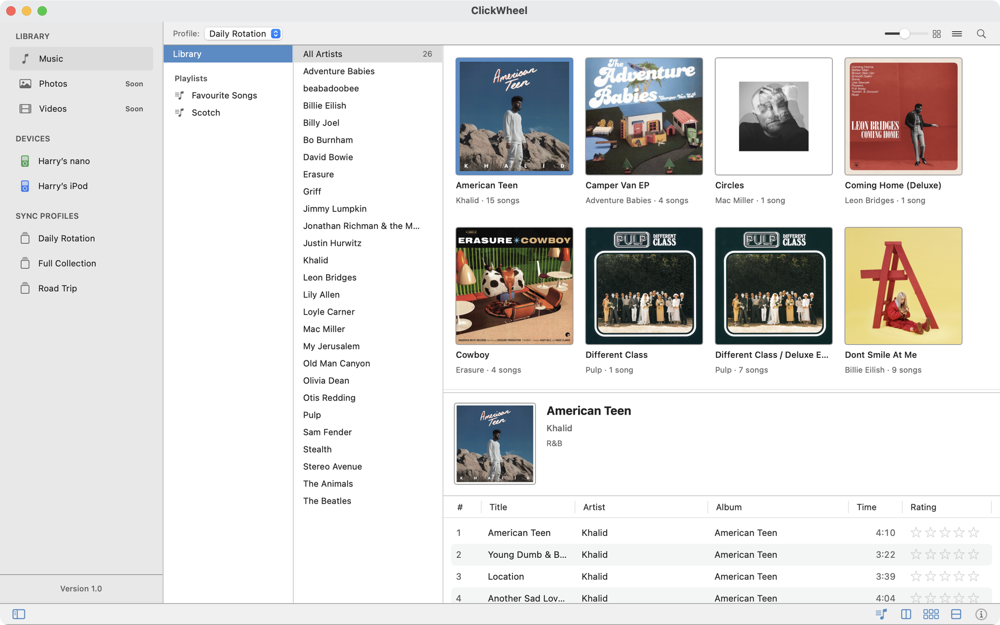
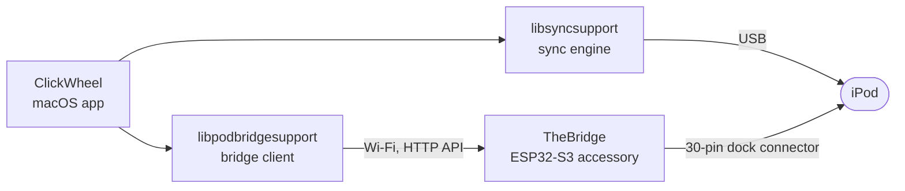
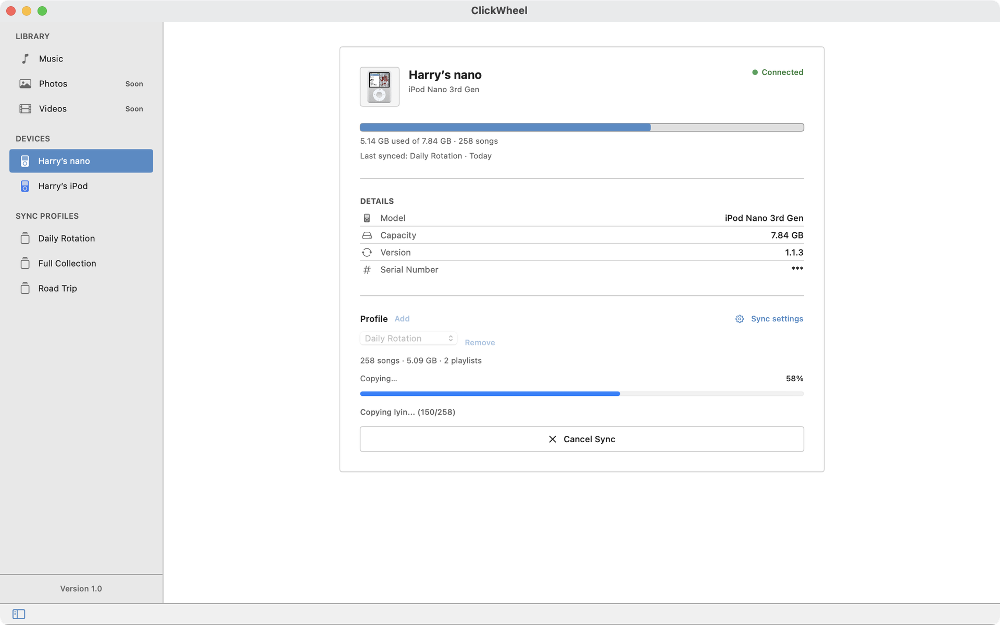
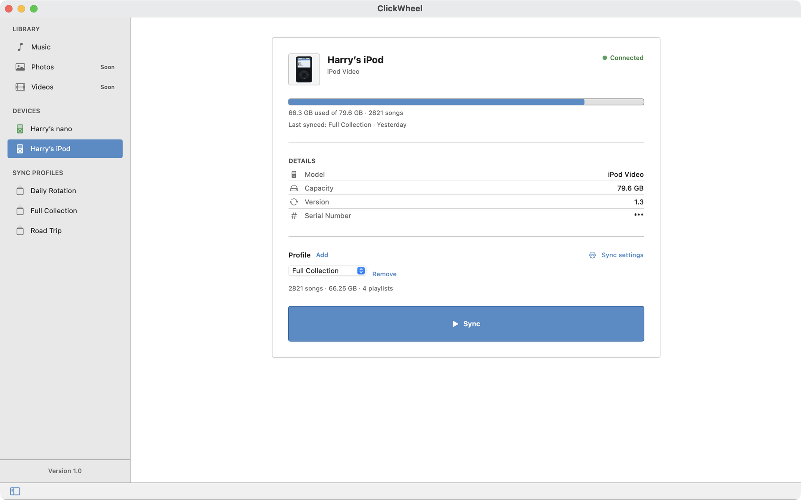
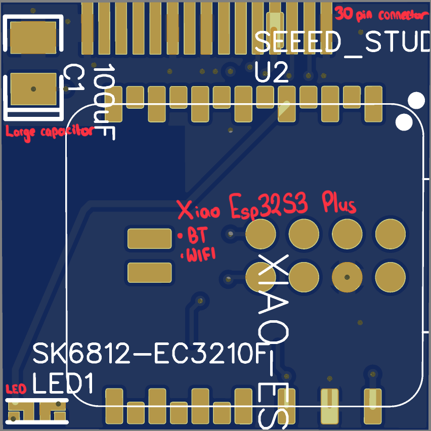
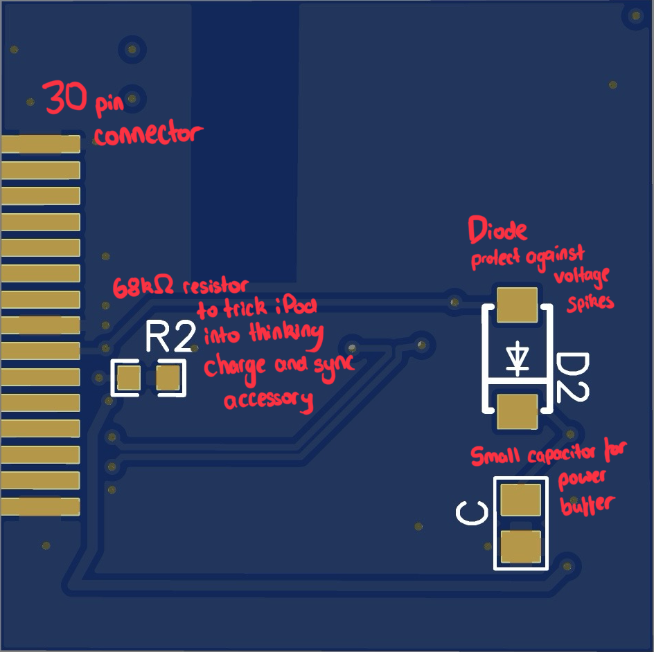
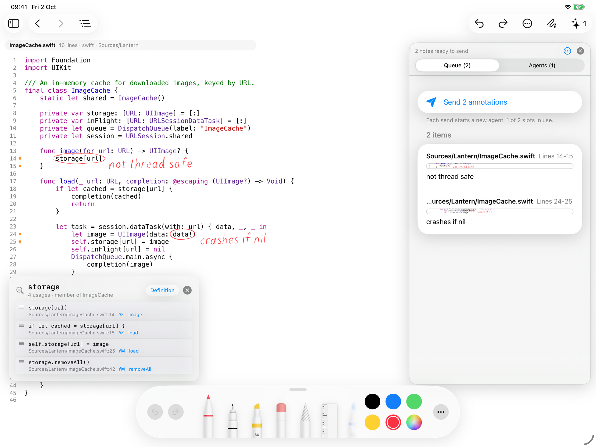
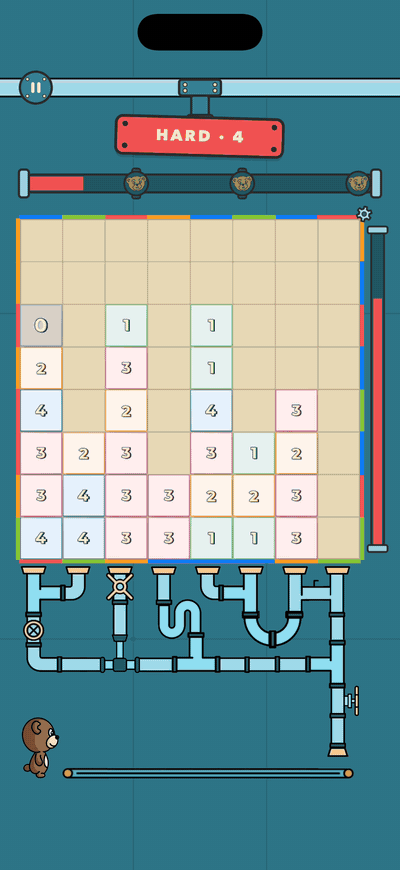
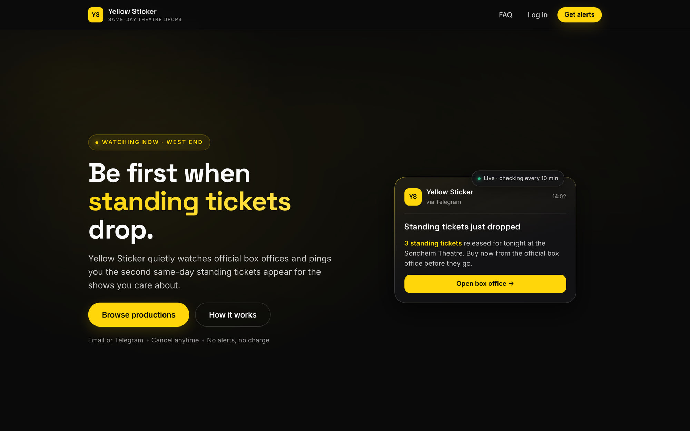

# docs-hub

**Private projects, documented in public.** 
A Mac app that brings classic iPods back to life, the custom hardware that syncs them over Wi-Fi, an iPad app for reviewing code by hand, a puzzle game and a live ticket-alert service. The source is private; each page below shows what the project does, how it is built and where it has got to.

  <a href="click-wheel/README.md">ClickWheel</a> ·
  <a href="libsyncsupport/README.md">libsyncsupport</a> ·
  <a href="the-bridge/README.md">TheBridge</a> ·
  <a href="libpodbridgesupport/README.md">libpodbridgesupport</a> ·
  <a href="iterate/README.md">Iterate</a> ·
  <a href="sliq/README.md">Sliq</a> ·
  <a href="yellow-sticker/README.md">Yellow Sticker</a>

---

## 🎵 The iPod Revival Ecosystem

Classic iPods still work, but nothing modern syncs them well. These four projects do it from scratch: a native Mac app, a sync engine that writes Apple's binary database format, and a wireless bridge that plugs into the 30-pin port.

| Project | What it is | Main tech | Status |
| --- | --- | --- | --- |
| [**ClickWheel**](click-wheel/README.md) | Native Mac app with a retro iTunes-inspired interface and per-device sync profiles, over USB or Wi-Fi. | Swift, SwiftUI, macOS | In development |
| [**libsyncsupport**](libsyncsupport/README.md) | Sync engine that writes the iTunesDB format in Swift, verified on real iPod hardware. | Swift package, ffmpeg | In development |
| [**TheBridge**](the-bridge/README.md) | ESP32-S3 accessory that plugs into the iPod's 30-pin port for wireless sync, with a custom four-layer PCB. | ESP32-S3, ESP-IDF, EasyEDA | Working prototype, PCB designed |
| [**libpodbridgesupport**](libpodbridgesupport/README.md) | Swift package that finds TheBridge on the network and talks to its HTTP API. | Swift package, Bonjour | In development |

How they fit together:

<table>
  <tr>
    <td width="50%"></td>
    <td width="50%"></td>
  </tr>
  <tr>
    <td align="center">A sync in progress over USB</td>
    <td align="center">An iPod Video connected through TheBridge</td>
  </tr>
</table>

### TheBridge: the hardware

A classic iPod only syncs over its dock connector, so TheBridge puts a Wi-Fi computer on the end of it. A Seeed Studio XIAO ESP32-S3 acts as a USB host, mounts the iPod's disk through the 30-pin port, and serves it to the Mac over a small HTTP API. A 68 kΩ resistor on the accessory pin makes the iPod treat it as a charge-and-sync accessory.

The hand-soldered proof of concept works end to end on external 5V power. A PCB about 25 mm square has been designed in EasyEDA and is being prepared for manufacture; running the bridge from the iPod's own power is the remaining open problem.

<table>
  <tr>
    <td width="34%"></td>
    <td width="33%"></td>
    <td width="33%"></td>
  </tr>
  <tr>
    <td align="center">Hand-soldered proof of concept</td>
    <td align="center">PCB design, top</td>
    <td align="center">PCB design, bottom</td>
  </tr>
</table>

The schematic, routed layout, component list and dock-connector wiring are on the [TheBridge page](the-bridge/README.md).

---

## ✏️ AI Developer Tools

<table>
  <tr>
    <td width="60%"></td>
    <td width="40%">
      <h3><a href="iterate/README.md">Iterate</a></h3>
      
Read and review code on iPad with Apple Pencil. Circle a line, scribble a note, and the handwriting becomes a structured review note that an AI coding agent can act on.

      
<b>Tech:</b> Swift, iPadOS, on-device git, Anthropic and OpenAI APIs

      
<b>Status:</b> In development

    </td>
  </tr>
</table>

---

## 🎮 Games

<table>
  <tr>
    <td width="25%"></td>
    <td width="75%">
      <h3><a href="sliq/README.md">Sliq</a></h3>
      
A fast tile-matching puzzle game built around a border that never stops turning. 36 hand-tuned levels and an endless Free Play mode, in a native Swift rewrite of a 2024 Python/Kivy prototype.

      
<b>Tech:</b> Swift, SpriteKit, Game Center

      
<b>Status:</b> Heading to the App Store

    </td>
  </tr>
</table>

---

## 🎭 London theatre

<table>
  <tr>
    <td width="60%"></td>
    <td width="40%">
      <h3><a href="yellow-sticker/README.md">Yellow Sticker</a></h3>
      
West End theatres release cheap standing tickets on the day, and they sell out fast. Yellow Sticker watches the box offices and alerts subscribers by email or Telegram the moment they appear.

      
<b>Tech:</b> React, TypeScript, Supabase, Stripe

      
<b>Status:</b> Live at <a href="https://www.yellowsticker.uk">yellowsticker.uk</a>

    </td>
  </tr>
</table>

---

## How these are built

Spec-driven projects, built with AI coding agents and fully reviewed before release.

> Source for any project is available on request, and I'm happy to walk through any of it.
