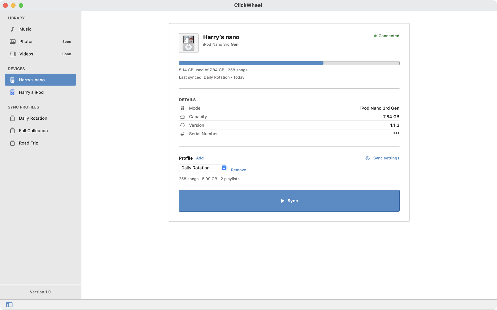
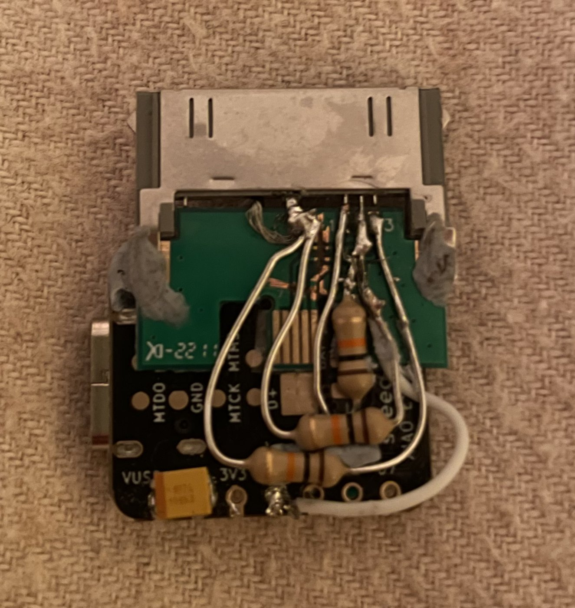

# ClickWheel

**A native Mac app for syncing music to classic iPods, over USB or wirelessly through a custom hardware bridge.**

> Status: in active development, not yet released. The source is private; I'm happy to walk through it on request.

## Why it exists

Classic iPods still have a devoted following, but syncing them on a modern Mac means going through Finder or the Music app, with little control and no way to manage several devices. ClickWheel is a dedicated app for it: choose exactly what goes on each iPod, sync it reliably, and do it wirelessly if you want to.

## What it does

- **Per-device sync profiles.** Pick the artists, albums and playlists for each iPod, and keep several iPods in sync from one library.
- **Smart sync.** A manifest stored on the iPod tracks what's already there, so over USB only new or changed tracks are copied.
- **Handles awkward formats.** Tracks are transcoded automatically where a model needs it, such as MP3 for the 1st-generation nano.
- **Wireless sync.** A small ESP32 bridge plugs into the iPod's 30-pin port and syncs over Wi-Fi.
- **Leaves your library alone.** ClickWheel reads the Music library and never modifies it.

| Editing a profile | Sync in progress | Wireless device |
| --- | --- | --- |
|  |  |  |

## The wireless bridge

The bridge is custom hardware, designed from scratch.

<!-- TODO: photo of the prototype next to an iPod, plus the PCB render. -->

- **Hardware:** a Seeed XIAO ESP32-S3 on a four-layer PCB with a 30-pin dock connector, an accessory-identification resistor, a TVS diode for protection and a status LED. Designed in EasyEDA, prototyped and hand-soldered.
- **Firmware:** the ESP32 talks to the iPod over the dock connector's USB lines and exposes a small HTTP API (status, device, find, upload, delete).
- **Discovery:** the Mac app finds the bridge over Bonjour (`_ipodbridge._tcp`) and polls it for a mounted iPod.
- **Status:** working prototype. It syncs wirelessly to an iPod Video and the 1st to 3rd-generation iPod nano when powered externally. Drawing power from the iPod itself is the next problem to solve.

## Technical highlights

- **Writes Apple's binary iTunesDB format** in Swift, including the device-specific checksums that later iPods require before they'll read a database: Hash58, and Hash72 for devices that already carry a HashInfo file. Built on the format work of the open-source libgpod project.
- **Verified on real hardware,** tracked in a compatibility matrix that separates tested, expected and implemented devices.
- **Reliable detection.** Devices are identified by USB vendor and product IDs, which matters because the iPod Video and iPod Classic need different checksums and artwork sizes.
- **Diagnosis over guesswork.** Playback defects were traced by probing actual audio (codec, bit depth, sample rate, duration) rather than trusting file metadata.
- **Safe writes.** Tracks are prepared in a temporary folder and the database files are written atomically, to reduce the risk of corrupting a device.

## How it's built

ClickWheel is a spec-driven project built with AI coding agents. I own the product and interface design, the hardware and the architecture, direct the agents, and am reviewing every part of the codebase before release. The sync engine is being documented in full as part of that review.

Stack: Swift and SwiftUI (macOS 15.6+), iTunesLibrary, ffmpeg, ESP32-S3, EasyEDA. The interface was prototyped in React before being built in SwiftUI.

---

# For developers

## Repository layout

ClickWheel is the app. Two Swift packages sit beside it:

- **libsyncsupport:** the sync engine. Writes iTunesDB and ArtworkDB, places media files, maintains the sync manifest, and handles transcoding and artwork resizing. Transport-agnostic, so it can be reused by other apps.
- **libpodbridgesupport:** the bridge client. Bonjour discovery, polling and a typed HTTP client for the ESP32 API.

The packages are private; in Xcode, point the package references at your local checkouts.

## Requirements

- macOS 15.6 or later, Xcode 16 or later
- Access to the Music library (iTunesLibrary framework)
- ffmpeg, recommended for reliable MP3 transcoding: `brew install ffmpeg`

## Build

1. Open `ClickWheel.xcodeproj` in Xcode.
2. Make sure both local packages resolve.
3. Build and run (⌘B, ⌘R).

## Usage

1. Connect the iPod over USB, or plug it into a powered ESP32 bridge on the same network.
2. Add the device when prompted.
3. Choose or create a sync profile and select what to sync.
4. Click **Sync**.
5. Eject wired devices when finished.

## Device support

| Device | Checksum | Status |
| --- | --- | --- |
| iPod nano 1st gen | None | Tested (MP3-only playback; other formats transcoded) |
| iPod nano 2nd gen | None | Tested |
| iPod nano 3rd gen | Hash58 | Tested |
| iPod nano 4th gen | Hash58 | Expected (same format as 3rd gen) |
| iPod nano 5th gen | Hash72 | Expected (needs the device's existing HashInfo file) |
| iPod nano 6th–7th gen | HashAB | Not working yet (signing relies on an external libhashab library); untested |
| iPod Video (5th gen) | None | Tested |
| iPod Classic (6th–7th gen) | Hash58 | Expected |
| iPod shuffle, mini, 1st–4th gen | — | Not supported |

**Model names matter.** Checksums and artwork tables are chosen from the device's model name, so the iPod Video (USB product ID `0x1209`) and iPod Classic (`0x1261`) must be told apart.

## Bridge API

The ESP32 exposes:

- `GET /status`
- `GET /device`
- `GET /find?path=...`
- `POST /upload?path=...`
- `DELETE /delete?path=...`

## Architecture

| Component | Role |
| --- | --- |
| `DeviceManager` | USB and bridge detection, device state, profiles |
| `MusicLibraryManager` | Reads and caches the Music library |
| `MediaLibraryResolver` | Resolves library entries to files on disk |
| `LibSyncSupportAdapters` | The seam between the app and the sync engine |
| `WirelessSyncService` | Stages files locally and uploads them through the bridge |

## Roadmap

- Fix the two known playback defects (stutter on some hi-res files, skip-ahead at the end of a track)
- Playlist sync, including recreating playlists made on the iPod
- Play-count persistence, with optional Last.fm scrobbling
- Draw power for the bridge from the iPod
- Interface polish and test coverage on core sync logic

## Credits

The iTunesDB format and its checksums were reverse-engineered by the [libgpod](https://sourceforge.net/projects/gtkpod/) community. ClickWheel's engine builds on that work.
