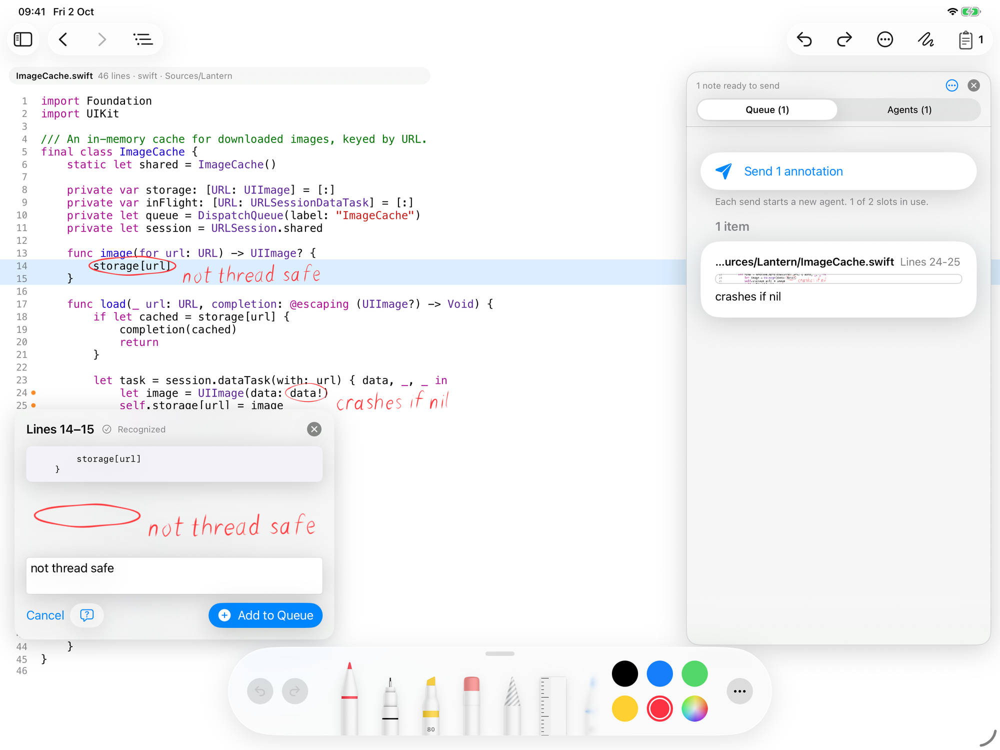
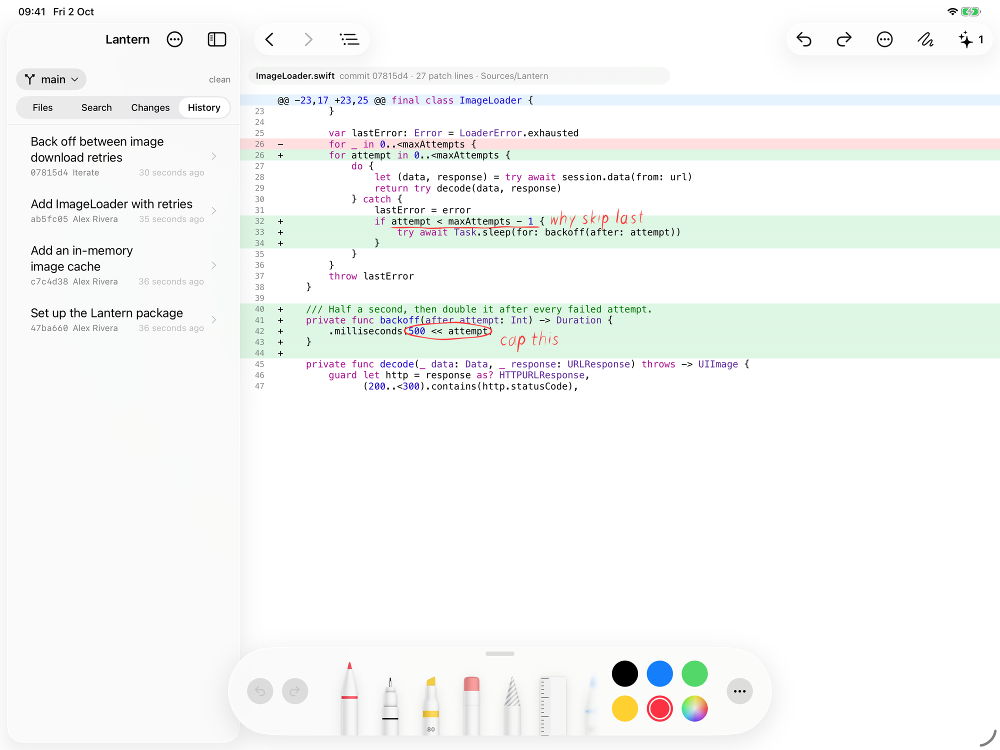
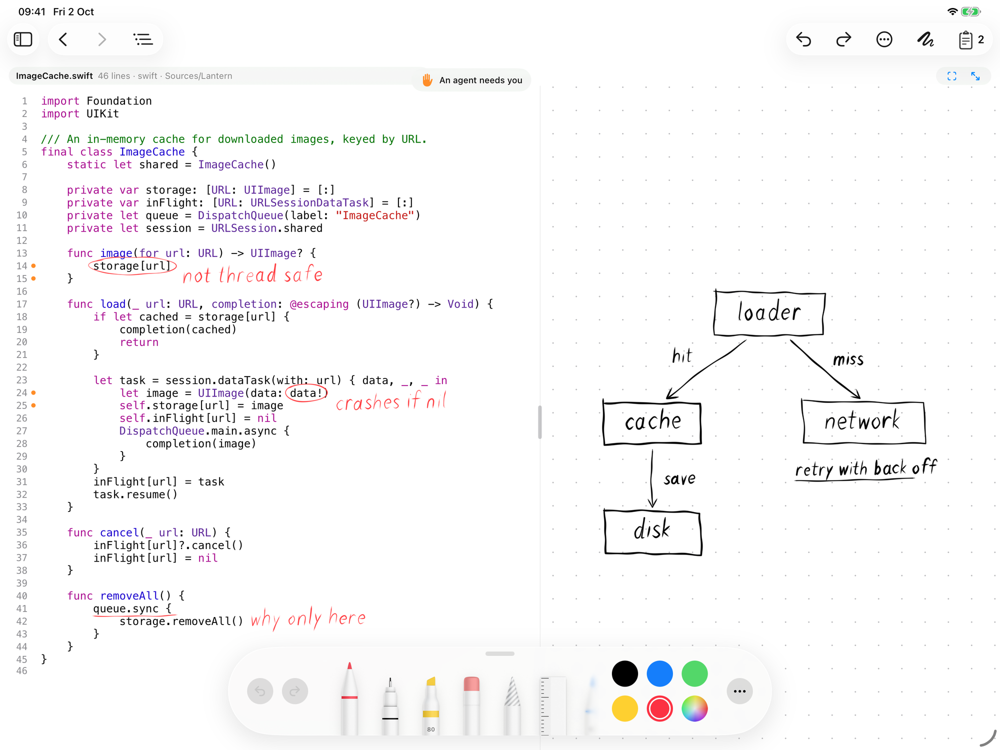
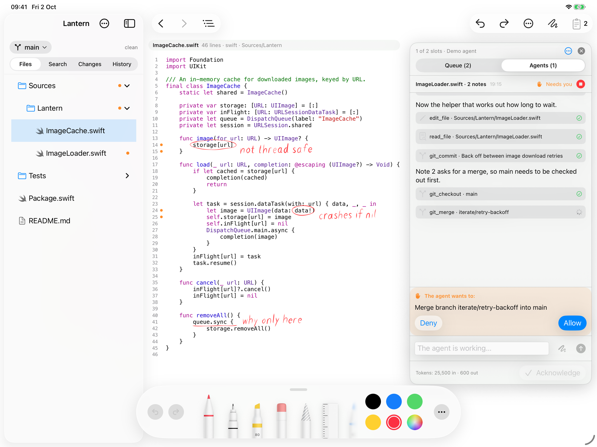

# Iterate

**Read and review code on iPad with Apple Pencil: mark it up by hand, trace how it fits together, and understand it before you sign it off.**

> Status: in active development, not yet released. The source is private; I'm happy to walk through it on request.


## Why it exists

Coding agents now write code faster than most of us can read it. The bottleneck has moved from writing code to understanding and reviewing it, and that work is still stuck at a desk. Iterate is a tool for that part of the job: read an unfamiliar codebase, or a branch that is up for review, properly and away from the laptop, mark it up by hand, and come away knowing how it works. When a note does call for a change, an agent can make it, but the reading comes first.

## What it does

- **Read code like paper.** Circle, underline and scribble on real source files with Apple Pencil. Handwriting is recognised on device and turned into structured review notes anchored to the lines they cover.
- **Find your way around an unfamiliar codebase.** Go-to-definition and find-usages without a language server, with each usage labelled by the function it sits in, plus a file outline and search across the folder.
- **Ask why, not just what.** A gutter showing how recently each line changed, "Why does this exist?" explanations from git history, explanations of the lines you select, and a whiteboard for sketching how the pieces fit.
- **Review changes, not just files.** Real git on the device: branches, history, diffs, clone, push and pull, with GitHub sign-in. Any commit's patch opens like a file and can be marked up the same way.
- **Hand off the follow-up.** Queued notes can go to an agent running on the iPad with your own API key. It answers questions by default and edits only when a note asks for a change; then it reads and edits files, creates branches, commits and merges, and shows its work as it goes. Destructive actions (deleting files, switching to or deleting existing branches, merging, discarding changes) wait for your approval. Several agents can work in parallel, and answers are kept until you acknowledge them.

<table>
  <tr>
    <td width="50%"></td>
    <td width="50%"></td>
  </tr>
  <tr>
    <td align="center">Handwriting recognised into a review note</td>
    <td align="center">A commit's patch, marked up like a file</td>
  </tr>
  <tr>
    <td width="50%"></td>
    <td width="50%"></td>
  </tr>
  <tr>
    <td align="center">The whiteboard beside the code</td>
    <td align="center">An agent waiting for approval to merge</td>
  </tr>
</table>

## Technical highlights

- **Ink that follows the code.** PencilKit strokes are clustered into annotations anchored to lines, and re-anchored when text size changes or the agent edits the file.
- **Code intelligence without a language server.** A fast workspace text search finds candidates, and a small, cheap model is only asked to rank or filter the results or explain code, keeping a typical lookup to a fraction of a cent.
- **Git without a shell.** iPadOS apps are sandboxed and can't launch other programs, so Iterate embeds libgit2 and wraps it in a Swift actor, with HTTPS remotes and bundled TLS certificates.
- **Provider-agnostic agent loop** in Swift, with adapters for Anthropic and OpenAI-compatible APIs (including OpenRouter): streaming over server-sent events and tool use, with prompt caching on Anthropic. A mock provider scripts a full agent turn offline for testing.
- **No backend.** Requests go straight from the iPad to the provider the user chooses, billed to their own key. GitHub tokens live in the Keychain and are only sent to GitHub (github.com and its API).

## How it's built

Iterate is a spec-driven project built with AI coding agents. I own the product design, architecture and specs, direct the agents, and am reviewing every part of the codebase before release. Much of that review happens in Iterate itself.

Stack: Swift, SwiftUI and UIKit (TextKit, PencilKit, Vision), libgit2, iPadOS 18+.

---

# For developers

## Building

Open `Iterate.xcodeproj` in Xcode 26 and run the `Iterate` scheme on an iPad (iPadOS 18 or later; the target is iPad-only). Dependencies are resolved through Swift Package Manager:

- [HighlighterSwift](https://github.com/smittytone/HighlighterSwift) for syntax highlighting (highlight.js, ~190 grammars).
- [static-libgit2](https://github.com/bdewey/static-libgit2) for git on the device (libgit2 1.3 as an XCFramework).

## Architecture

| Layer | Files | Notes |
| --- | --- | --- |
| Workspace | `Workspace/` | Security-scoped bookmarks for opened folders, a coordinated `FileService` actor for reads, writes and search, a change tracker, and an `NSFilePresenter` for edits made by other apps. |
| Git | `Services/Git/GitService.swift`, `Services/Git/GitRemote.swift` | An actor over libgit2: branches, log, status, unified diffs (working tree, or one commit against its parent, per file), the files a commit touched, checkout, commit, merge (with conflict reporting), branch deletion, discard. `GitRemote.swift` adds clone, fetch, push and pull over HTTPS with progress and cancellation, ahead/behind against the tracking branch, and TLS verification (OpenSSL against the bundled `cacert.pem`, falling back to the system trust store). `Models/DiffDocument.swift` reshapes a patch for the code view. |
| GitHub | `Services/GitHub/`, `Views/GitHub/` | Sign-in through the OAuth device flow (no client secret, nothing hosted) or a personal access token, stored in the Keychain and only ever sent to github.com; the repository list; the clone sheet. |
| Agent | `Agent/` | A provider-agnostic `LanguageModelProvider` protocol with adapters for the Anthropic Messages API (streaming, tool use, prompt caching) and the OpenAI chat-completions format (also used for OpenRouter). `AgentSession` runs the loop for one submission; several sessions run side by side and each is persisted by `TranscriptStore` until acknowledged. `AgentToolbox` defines and executes the file and git tools; `AgentPrompt` builds the system prompt (tuned for short, direct answers to a reviewer's notes) and the annotation submission. A debug-only `MockProvider` scripts a full turn offline. A user entry can carry pictures (`TranscriptImage`, PNG in the transcript JSON); the Anthropic adapter sends them as base64 image blocks and the OpenAI adapter as data-URL `image_url` parts. |
| Editor | `Views/CodeTextView.swift`, `InkCanvasView.swift`, `AnnotationController.swift` | Read-only TextKit 1 text view with a gutter, a `PKCanvasView` stacked over it, scroll and content-size sync, stroke clustering into line-anchored annotations, and re-anchoring when text size changes or a file is reloaded. |
| Review | `Views/ReviewPanelView.swift`, `Services/HandwritingRecognizer.swift`, `Services/MarkdownExporter.swift` | Rasterises an annotation, runs `VNRecognizeTextRequest`, and renders queued notes as Markdown (also shareable as a `.md` file). |
| Code intelligence | `Services/CodeIntelligence/`, `Views/CodeIntelligence/`, `Views/Sidebar/SearchTabView.swift` | Read-only IDE features without a language server. `SymbolAnalysis` has regex heuristics for identifiers, declarations, file outlines and enclosing scopes; `CodeIntelligence` runs a workspace text search first and asks a small model (`QuickModelClient`, one call, no tools) only to rank ambiguous declarations, drop unrelated usages, explain code or commits, or answer a question with a short read-only tool loop. |
| Shell | `ContentView.swift`, `Models/AppModel.swift`, `Views/Sidebar/`, `Views/Agent/` | Split view with the workspace sidebar, the floating agent panel, settings, and the reload banner. |
| Insights | `Services/Git/GitService.swift` (blame), `Workspace/QuestionLog.swift`, `Views/CodeIntelligence/` | Blame through libgit2, run against the text on screen so uncommitted lines are flagged, drives the change-age strip in the gutter, the "who changed this" line on the review panel, and the *Why Does This Exist?* prompt. Logged questions are JSON per folder in Application Support; assumptions, trace and origin explanations are single calls to the cheap model in `CodeIntelligence`. |
| Whiteboard, unread flags | `Models/Whiteboard.swift`, `Views/WhiteboardView.swift`, `Workspace/UnreadMarks.swift` | A per-folder `PKCanvasView` whose drawing area grows as ink nears an edge (growing left or up shifts the ink and the viewport together, so coordinates stay positive), with a dot grid that redraws with the scroll offset. `WhiteboardSplit` is closed, open at a fraction of the code column, or filling the screen; the divider is dragged in the app's coordinate space and both panes follow it, keeping whatever width the finger leaves them at. The pane draws on `DocumentViewModel.editorBackground`, and its canvas takes the matching interface style so PencilKit renders ink for that paper. `AppModel.activeInkSurface` records which canvas was last drawn on (set from `canvasViewDidBeginUsingTool` on both), so one set of ink tools in the toolbar serves the code overlay and the board. `WhiteboardControlsView` is laid out in the code's own top row and offset across the board, which is what keeps it level with the file pill; `Whiteboard.snapshot` renders the ink for the paper it sits on and fills that paper in behind it, so the agent receives the board as it looks on screen: light ink on dark paper under a dark theme. Unread flags are a set of paths per folder, pruned on rescan and cleared when a file is opened. |

Each queued note is sent to the agent in this form:

```
File: `Sources/ImageCache.swift`
Lines 22-24
Code snippet

```swift
let task = URLSession.shared.dataTask(with: url) { data, response, error in
    let image = UIImage(data: data!)
    self.storage[url] = image
```

Review Note: force unwrap will crash on a failed request
```

A note made on a commit's patch carries a `Context:` line naming the commit and mapping the patch lines to file lines, and its snippet keeps the `+`/`-` prefixes.

## Constraints worth knowing

- **Keys, not subscriptions.** Anthropic does not allow third-party apps to offer claude.ai login or plan rate limits, so Iterate only accepts API keys. The same is true for the other providers.
- **Foreground only.** iOS suspends the app shortly after it leaves the screen, so a long agent turn pauses if you switch away. Split View or Stage Manager keeps it running.
- **HTTPS remotes only.** Clone, fetch, push and pull go through libgit2's HTTP transport; SSH remotes can be opened but not synced from the iPad. The GitHub token is only offered to github.com. To enable *Sign in with GitHub* in your own build, register an OAuth App at github.com/settings/developers with *Enable Device Flow* ticked and put its client ID in `GitHubConfiguration.clientID`; without it, the app still accepts a personal access token.

<details>
<summary><strong>Full user guide</strong></summary>

1. **Open a folder** with the folder button, or tap *Try the Sample Repository* to get a small git repo to play with. Folders placed in Files under *On My iPad › Iterate*, and repositories synced by apps such as Working Copy, can all be opened. Or tap *Clone from GitHub…*: with GitHub connected (Settings › Integrations, or the sign-in inside that sheet) it lists your repositories, clones the one you pick into *On My iPad › Iterate* and opens it. Public repositories can be cloned by URL without an account.
2. **Pick a branch** from the picker at the top of the sidebar. Next to it, the sync pill shows how the branch relates to its remote (*unpublished*, *↑2*, *↓1*, *synced*) and offers Push, Pull and Fetch; the agent has a matching `git_push` tool that asks for confirmation. The *Files* tab shows the tree with change flags and git badges, *Changes* shows the working tree against HEAD (tap a file for its diff), *History* lists recent commits. Tap a commit to list the files it touched; tap a file to open its patch in the code view, with added lines in green, removed lines in red, and the file's own line numbers in the gutter. A patch can be marked up and queued like any file.
3. **Draw** with Apple Pencil. Fingers scroll; pinch with two fingers to step the text size. (In the Simulator, or after choosing *Pencil and Finger* in Options, one finger draws and two fingers scroll.)
4. **Review a mark** by double-tapping it, or pressing and holding, with a finger. The ink is recognised with Vision and shown with the code it covers; edit the note if needed and add it to the queue.
5. **Send** the queue from the work panel's *Queue* tab. One toolbar button opens the panel, on whichever of its two tabs had something happen to it last: a note queued, or an agent started or finished. Every send starts a new agent; up to *Maximum agents* (Settings) can exist at once. The Agents panel has a tab per agent and shows what each reads, edits and commits. Destructive actions (deleting paths, switching or deleting branches, merging, discarding changes) wait for your Allow or Deny. A finished agent keeps its slot until you tap *Acknowledge*, so an answer is never lost; unacknowledged agents come back after a relaunch. After it answers, a reply box under the transcript continues the same thread, so you can ask a follow-up without starting a new agent; a question the agent marks `[CLARIFY]` is pinned above that box.
6. **Navigate** with a finger. Double-tap an identifier that has no ink on it to see where it is declared; press and hold to list everywhere it is used, each usage labelled with the function it sits in (tap that label to walk up the call chain). Results are limited to the code that can actually see the tapped symbol: a local stays inside its function, a private helper inside its file, an imported name inside the file that exports it and the files importing it, and a member of a type or component inside the files that mention that type. So `onClick` on `<Button>` finds `Button`'s prop, not every `onClick` in the project; a link at the bottom of the panel shows the mentions outside that scope. Tap a result to jump there; the back and forward buttons return you. The outline button lists the file's declarations, and the *Search* tab in the sidebar finds files by name and text by content.
7. **Ask** when a search is not enough. *Explain* on the review panel describes the selected lines, *Explain with AI* on a commit summarises its diff, and the *Ask* tab answers a question about the repository with links into the code. These use your own key with the cheapest model of your provider (Haiku for Anthropic) and cost a fraction of a cent each; Settings shows the running total.
8. **Sketch** on the whiteboard (the scribble button in the toolbar, or ⌘⇧B). It opens as a pane beside the code, with one divider between the two. Drag the divider and the board stays exactly where you let go; carry it over all of the code, or double-tap it, and the board fills the whole screen; carry it off the right and the board closes. Both panes follow the divider as you drag, stopping only once the board is too narrow to use. Pressing the code never closes the board. The board takes the open file's own editor background, so the two sides read as one surface: on a dark theme the paper is dark and the ink is light, and the picture sent to the agent looks the same. The board has no bar of its own. Undo, redo and the pen palette in the app's toolbar act on whichever canvas you last drew on, and only two controls sit over the board, in the same capsule the file pill uses and on the same line as it: centre the ink, and fill the screen. Close the board by tapping the toolbar button again or carrying the divider off the right. Holding the toolbar button picks the paper (dots, grid, lines or blank, remembered across launches), attaches the sketch to the queue, and clears the board. The canvas itself has no edges: draw towards one and it grows; pinch to zoom out, and *Fit* brings all the ink on screen. Each folder keeps its own board, and a shared one is there when nothing is open. The board can go to the agent: *Attach to the Queue*, on the whiteboard button's hold menu, puts the sketch in the queue like a note, to be sent as a picture beside the notes or on its own as the whole brief. Swipe it in the queue to take it back out. The reply box under an agent's answer has its own switch for sending the board with a follow-up. The agent is told to read boxes, arrows and handwriting as the intended structure and to ask before acting on an ambiguous sketch.
9. **Flag** a file to come back to by swiping it in the sidebar, or from its context menu (a folder can be flagged whole) or the Options popover. A flagged file is bold with a blue dot, its folders show a count, and opening the file clears the flag. *Mark All as Read* is under the sidebar's folder menu.

10. **Dig** further from the review panel's *Ask AI* menu. *Why Does This Exist?* puts the commits that last touched the marked lines (message and patch) beside the code and asks what they were for and whether the reason still holds. *Find Assumptions* lists what the enclosing code takes for granted, each as a tappable line that can be added to the queue as a note. In the symbol panel, *Trace* follows a value from its declaration through its usages. The panel also says who last changed the lines.
11. **See age** in the gutter, once *Show Change Age* is on under Options. In a git repository a strip along the left edge colours each line by when it last changed: red is recent, grey is old, brightest is not committed yet. Double-tap the strip with a finger to open that commit's patch.
12. **Log questions** you cannot answer yet: the speech-bubble button on the review panel keeps the note as a question with the code it was about, and the Ask tab has a *Log* button for typed ones. They wait in the Ask tab until you answer one, or all, with the model; answers and their links stay with the folder.
13. **Reload** when prompted. Files are not reloaded while the agent works; changed files get an orange flag in the sidebar, and when the agent finishes, a banner offers to reload the open file. Your ink follows the lines that survived the edit.

The toolbar keeps only undo, redo, options, the whiteboard and the work panel. The pen palette, the text size, the drawing input, the change-age strip and the way into keys and models all live behind the options button, so there is one place for settings rather than two.

Set API keys and choose a model under the gear icon. Model lists are fetched from each provider; a custom model id can be typed for anything not listed.

</details>
