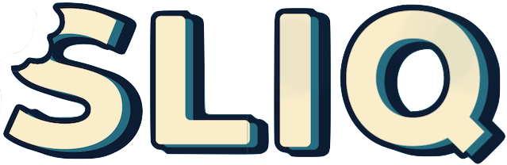
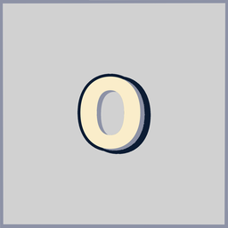
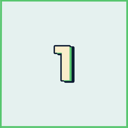
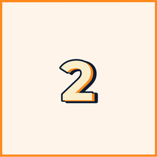
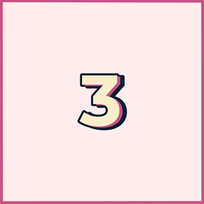
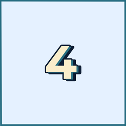
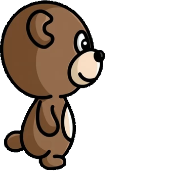
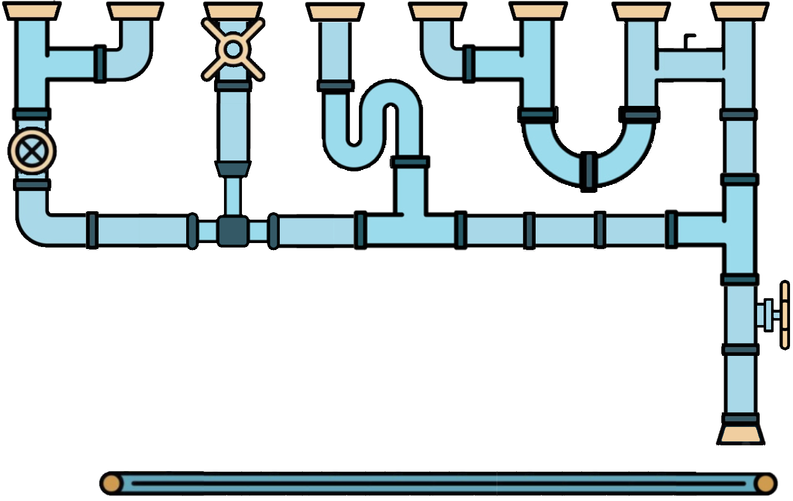

# SLIQ

**A fast tile-matching puzzle game for iPhone, built around a border that never stops turning.**

> Status: finished and TestFlight-ready, heading to the App Store. The source is private; I'm happy to walk through it on request.

## The game

Numbered tiles pile up on a board ringed by a coloured border that keeps rotating. Swipe a tile out through an edge of its own colour and it scores, but every swipe costs it a point, so the longer you take to line one up, the less it's worth. Let the board fill to the top and you lose.

It's simple to learn and hard to master: 36 hand-tuned levels across three difficulty bundles, plus an endless Free Play mode with a Game Center leaderboard.

  

  

## From a text game to the App Store

SLIQ started in 2020 as a 277-line text game in Python. In 2024 it became a playable iPad prototype in Python and Kivy. This version is a full rewrite in Swift for performance and polish, and the game's own Origins screen (Settings › About) shows its history, using real screenshots and transcripts produced by running the old code unmodified.

## Technical highlights

- **A deterministic rules engine, separate from rendering.** All game rules live in one Swift file with no SpriteKit or UIKit dependency. Every random choice goes through a seeded generator, so any game can be replayed exactly from its seed.
- **Event-driven, self-healing animation.** Each player action returns a list of engine events, which the SpriteKit layer turns into a timed animation schedule. A reconciler compares sprites against the engine's state about once a second, so any visual drift repairs itself within a second instead of breaking a game.
- **Difficulty measured, not guessed.** A headless simulator compiles the real engine on its own and plays every level hundreds of times with each of four bot skill tiers, from button-masher to planner, all moving at a measured human pace. Level targets are set from the resulting score distributions, so Easy is an on-ramp and Hard leaves even the best bot under 20% on its hardest levels.
- **Levels as data.** All 36 levels are a single table, each row stating only how it differs from its bundle's baseline.
- **Tested and previewable.** 150 unit tests cover the rules engine, level table, saved progress and unlocks, and every screen and component has an Xcode preview.
- **No third-party dependencies.** Apple frameworks only, chiefly SpriteKit, UIKit and Game Center.

## How it's built

SLIQ is a spec-driven project built with AI coding agents. I designed the game, its rules and its look, set the balance goals, direct the agents, and am reviewing every part of the codebase before release.

Stack: Swift, SpriteKit, UIKit, Game Center, iOS 18.5+.

---

## How to play

- **Tiles** carry a value of 1–4. That number is both the points it's worth and the moves it has left. Swipe it left or right and it drops one.
- **Score** by matching colours. Push a tile through a side border of its own colour, or let it land on a matching bottom edge and it falls through by itself. Either way it scores its current value, with no move cost.
- **The border rotates** on a timer, bringing a fresh edge in at the top and dropping new tiles in behind it. The valve on the right turns it early, which is handy when nothing on the board is playable, but it costs you a wave of new tiles.
- **A tile worn down to 0** is dead weight, for good. It can't be moved, can't score and never leaves the board. Think twice before moving a 1.
- **You lose** when a tile comes to rest in the top row.
- **Stars** are awarded at 33%, 65% and 100% of the level's target, so a strong loss still earns progress.

## Progression

Three bundles (Easy, Medium and Hard) of twelve levels each, and one currency: bear heads, 36 to a bundle and 108 in the game. Medium costs 36 earned anywhere; Hard and **Free Play** cost 72. Free Play is an endless score attack you configure yourself, with a Game Center leaderboard for runs on the ranked preset.

Within a bundle, each level opens once you've earned at least one head on the level before it. That's what the pipe snaking through the level screen shows: the flow stops where you have.

## Art

    

The five tile faces, values 0 to 4.

   

The border edges a tile has to match.

   

Every tile you score travels the pipes below the board and is eaten by the bear, who grows as you close in on the target.

