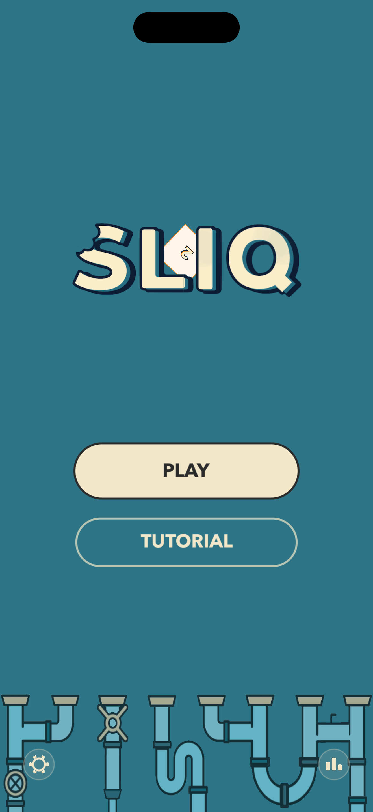
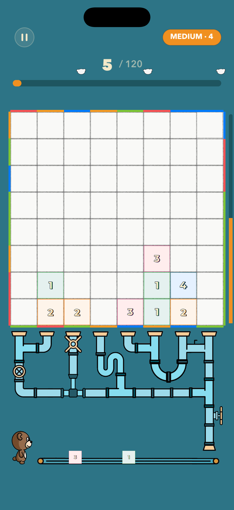
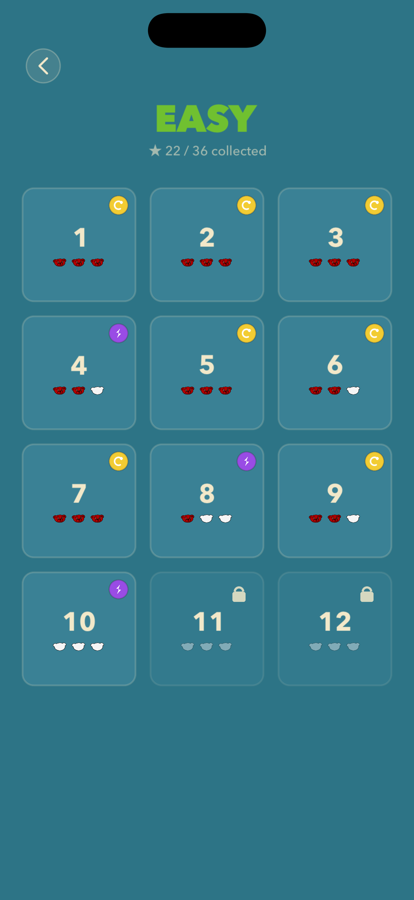
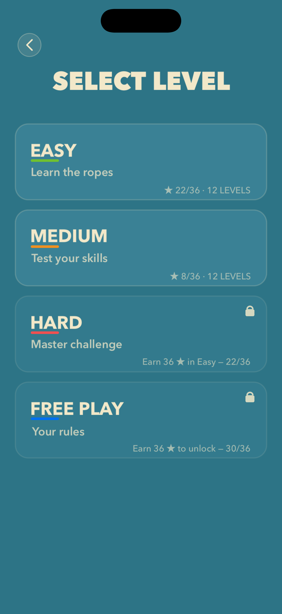
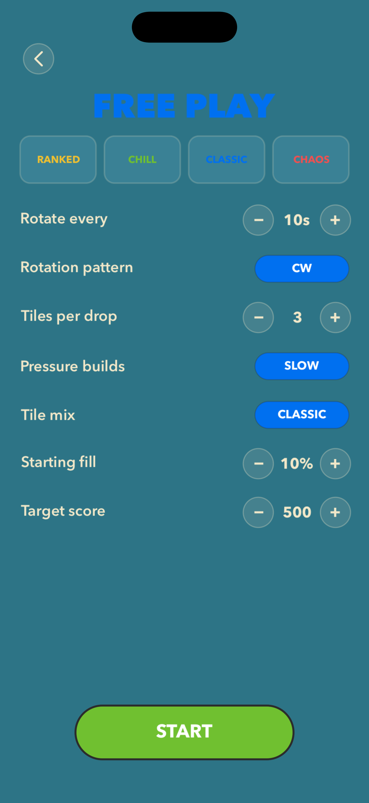
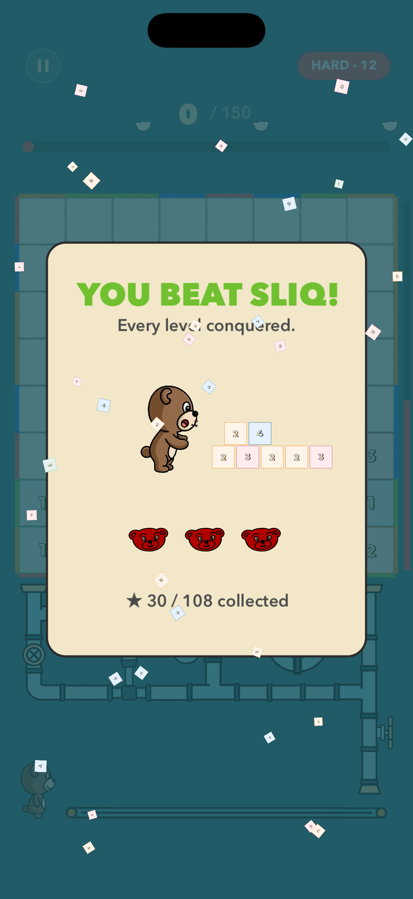

# SLIQ

SLIQ is a tile-based puzzle game for iOS. Numbered tiles pile up on a board
ringed by a coloured border that keeps rotating. Swipe a tile out through an
edge of its own colour and it scores — but every swipe costs it a point, so the
longer you take to line one up, the less it is worth.

## How to play

- **Tiles** carry a value of 1–4. That number is both the points it is worth and
  the moves it has left. Swipe it left or right and it drops one.
- **Score** by matching colours. Push a tile through a side border of its own
  colour, or let it land on a matching bottom edge and it falls through by
  itself. Either way it scores its current value, with no move cost.
- **The border rotates** on a timer, bringing a fresh edge in at the top and
  dropping new tiles in behind it. The valve on the right turns it early — handy
  when nothing on the board is playable, but it costs you a wave of new tiles.
- **A tile worn down to 0** is dead weight. It cannot be moved or scored; it only
  clears by falling through the bottom row.
- **You lose** when a tile comes to rest in the top row.
- **Stars** are awarded at 33%, 65% and 100% of the level's target, so a strong
  loss still earns progress.

## Progression

Three bundles — Easy, Medium and Hard — of twelve levels each. Medium opens at
18 stars in Easy and Hard at 36. Collect 36 stars overall to unlock **Free
Play**: an endless score attack you configure yourself, with a Game Center
leaderboard for runs on the ranked preset.

## Screens

  

  

## Art

    

The five tile faces, values 0 to 4.

   

The border edges a tile has to match.

   

Every tile you score travels the pipes below the board and is eaten by the bear,
who grows as you close on the target.

## Building it

Open `Sliq.xcodeproj` and run the **Sliq** scheme on any portrait iPhone
simulator. Developer documentation lives beside this file — start with
[the repository README](../README.md).
