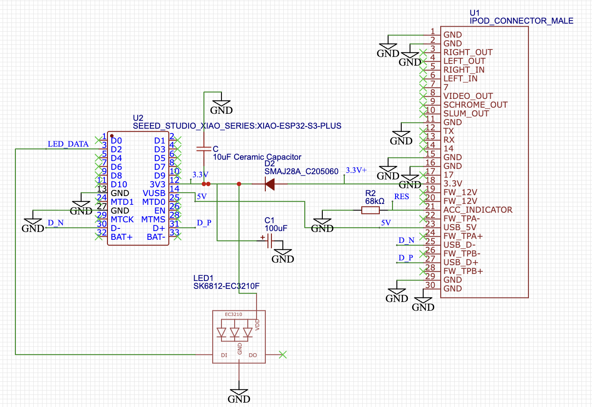
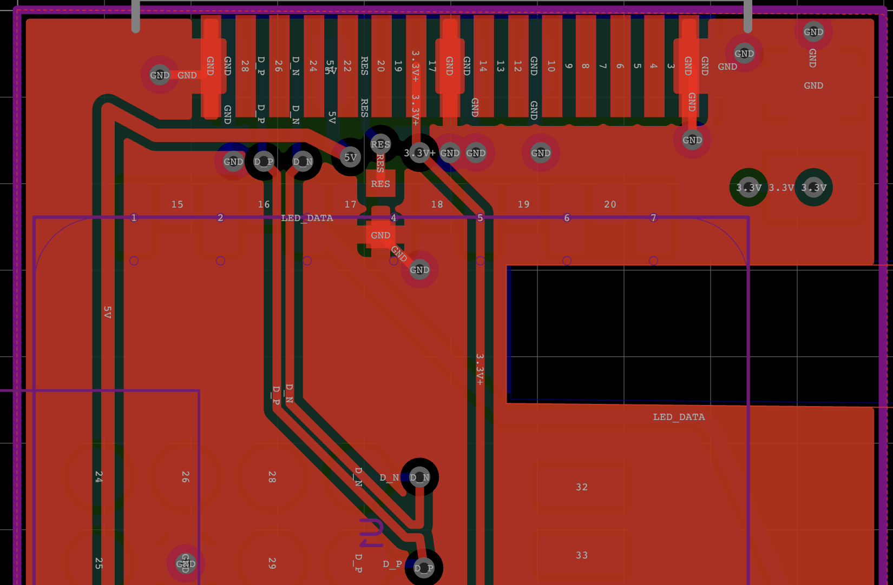

# TheBridge

Ultra-miniature wireless sync bridge for legacy Classic iPods using ESP32-S3 USB OTG host.
Runtime hostname and mDNS service remain `ipodbridge.local`.

## Architecture Overview

```
┌─────────────────────────────────────────────────────────┐
│         macOS / Mac Computer                            │
│  (runs your client app or curl commands)                │
└────────────┬────────────────────────────────────────────┘
             │ Wi-Fi (2.4GHz)
             │
┌────────────▼────────────────────────────────────────────┐
│  ESP32-S3 (Seeed Studio XIAO)                          │
│  ┌─────────────────────────────────────────────────┐   │
│  │ Web Server (Port 80) + mDNS (ipodbridge.local)  │   │
│  │                                                  │   │
│  │ HTTP API: see API.md                             │   │
│  └─────────────────────────────────────────────────┘   │
│                    │                                    │
│  ┌─────────────────▼─────────────────────────────────┐  │
│  │ USB Host (MSC) - MSC Host Driver                 │  │
│  │ - VFS mount: /usb                               │  │
│  │ - Block device: FAT32 read/write                │  │
│  │ - Streaming: Direct POST→File                   │  │
│  └─────────────────┬─────────────────────────────────┘  │
│                    │ USB OTG Host                       │
└────────────────────┼────────────────────────────────────┘
                     │ USB (5V, GND, D+, D-)
                     │
            ┌────────▼────────┐
            │  iPod Nano      │
            │  (FAT32 on USB) │
            │  30-pin Dock    │
            └─────────────────┘
```

## Key Features

✓ **Zero-Configuration Discovery** - mDNS automatically broadcasts `ipodbridge.local`
✓ **Direct File Streaming** - POST data bypasses intermediate buffers, streams directly to iPod
✓ **Low Memory Footprint** - Total stack usage < 12KB, optimized for 1-inch form factor
✓ **FAT32 VFS Mount** - Direct filesystem access to iPod_Control directories
✓ **Dual Personality** - Simultaneous Wi-Fi station + USB host modes
✓ **Atomic USB Handshake** - iPod auto-enters "Do Not Disconnect" when connected

## Hardware

**Status:** the hand-soldered proof of concept works end to end with external 5V power. A PCB has been designed in EasyEDA and is being prepared for manufacture. Running the bridge from the iPod's own power is the remaining open problem.

### Proof of concept


A Seeed Studio XIAO ESP32-S3 wired directly to a 30-pin dock connector.

### PCB

The board is about 25 mm square, with the XIAO soldered flat onto one side and the 30-pin connector along one edge.

| Top | Bottom |
| --- | --- |
|  |  |





### Components

| Ref | Part | Purpose |
| --- | --- | --- |
| U2 | Seeed Studio XIAO ESP32-S3 Plus | Wi-Fi and USB host |
| U1 | 30-pin iPod dock connector (male) | Plugs into the iPod |
| R2 | 68 kΩ resistor | On the accessory-indicator pin, so the iPod treats the bridge as a charge-and-sync accessory |
| D2 | SMAJ28A TVS diode | Protection against voltage spikes |
| C1 | 100 µF capacitor | Bulk power buffer |
| C | 10 µF ceramic capacitor | Small power buffer |
| LED1 | SK6812-EC3210F addressable LED | Status light, driven from D2 (not yet used by the firmware) |

### Dock connector wiring

| 30-pin connector | Signal | Connects to |
| --- | --- | --- |
| 1, 2, 11, 15, 16, 29, 30 | GND | Ground |
| 18 | 3.3V | 3.3V rail (XIAO `3V3`), through D2 |
| 21 | Accessory indicator | R2 (68 kΩ) to ground |
| 23 | USB 5V | XIAO `VUSB` |
| 25 | USB D− | XIAO `D-` |
| 27 | USB D+ | XIAO `D+` |

### Testing setup

For bench testing, a USB-C OTG splitter supplies 5V to both the XIAO and the iPod:

```
Mac USB Port
    ↓
USB-C OTG Splitter
    ├─ USB→XIAO (Data + Power)
    └─ USB→iPod (Power Only)
```

## Software Architecture

### Core Modules

#### 1. USB MSC Host (`msc_host.h`)
- **Function:** Acts as USB Host controller
- **Driver:** ESP-IDF `usb/msc_host.h`
- **Mount Point:** `/usb`
- **Filesystem:** FAT32 (read/write)

#### 2. VFS Layer (`esp_vfs_fat.h`)
- **Function:** Maps USB block device to filesystem
- **Features:** Direct file I/O with standard POSIX calls
- **Optimization:** 4KB allocation unit for small files

#### 3. Wi-Fi Station (`esp_wifi.h`)
- **Mode:** Station (STA) - connects to existing Wi-Fi network
- **mDNS:** Broadcasts hostname as `ipodbridge.local`
- **Connection:** Automatic reconnection on drop

#### 4. HTTP Server (`esp_http_server.h`)
- **Framework:** Built-in ESP-IDF HTTP server
- **Stack Size:** 6KB (minimal)
- **Max Connections:** 2 simultaneous
- **Endpoints:** See `API.md`

#### 5. Streaming Handler
```
HTTP POST Request with binary file data
    ↓
httpd_req_recv() reads chunks from socket (512 bytes)
    ↓
fwrite() writes directly to VFS-mounted USB device
    ↓
FAT32 driver on USB updates iPod's filesystem
    ↓
Zero intermediate buffering - low RAM usage
```

## Compilation & Deployment

### Prerequisites
```bash
# Install PlatformIO CLI
pip3 install platformio

# PlatformIO will auto-install ESP-IDF when first building
```

### Build
```bash
cd /Users/harry/SyncPod
pio run -e seeed_xiao_esp32s3
```

### Upload Firmware
```bash
pio run -t upload -e seeed_xiao_esp32s3
```

### Monitor Serial Output
```bash
pio device monitor -e seeed_xiao_esp32s3 -b 115200
```

## Configuration

Create a local config header for Wi-Fi credentials:

```bash
cp include/config.example.h include/config.h
```

Then edit `include/config.h` to set `THEBRIDGE_WIFI_SSID` and `THEBRIDGE_WIFI_PASS`.

See [CONFIGURATION.md](CONFIGURATION.md) for configuration details and [API.md](API.md) for the HTTP API.

## Usage Examples

See `API.md` for all endpoint examples.

### Device Discovery
```bash
# List all _http._tcp services on network
dns-sd -B _http._tcp local

# Ping the device
ping ipodbridge.local

# Check network info
dig ipodbridge.local
```

## Performance Characteristics

| Metric | Value |
|--------|-------|
| **Wi-Fi Connection Time** | ~3-5 seconds after boot |
| **USB Mount Time** | ~1-2 seconds after USB connection |
| **Stream Speed** | ~0.9 MB/s (USB Full-Speed MSC write) |
| **Memory Usage (Idle)** | ~50-70 KB heap |
| **Memory Usage (Streaming)** | ~100-120 KB heap |
| **Upload Latency** | < 100ms per request |

## Memory Budget (ESP32-S3 with 512KB SRAM)

```
FreeRTOS Kernel:        ~40 KB
HTTP Server:             ~15 KB  (includes socket buffers)
USB MSC Host:           ~30 KB
Wi-Fi Stack:            ~60 KB
File I/O Buffer:        ~8 KB
FAT VFS:               ~20 KB
mDNS:                   ~10 KB
─────────────────────────────
Total Nominal:         ~183 KB (36% of SRAM)
Headroom:              ~329 KB (available for streaming buffer)
```

## Troubleshooting

### USB Device Not Detected
```
Expected serial output:
  I (xxx) TheBridge: Initializing USB Host MSC
  I (yyy) TheBridge: USB MSC Device connected
```

If you see timeout instead:
1. Check USB connector physical connection
2. Verify 5V power is reaching the iPod
3. Try different USB cable
4. Ensure iPod is in USB charging/sync mode (not offline mode)

### File Write Failures
```
Error in logs:
  E (xxx) TheBridge: Write error: requested 512, wrote 0
```

Causes:
1. iPod filesystem is full
2. `/usb/iPod_Control/` directory doesn't exist
3. USB connection was interrupted
4. FAT filesystem corruption on iPod

**Solution:** Unmount iPod, restart on computer, check disk integrity.

### Wi-Fi Connection Problems
1. Only 2.4 GHz is supported (not 5 GHz)
2. Check SSID/password in source code
3. Monitor serial for authentication details
4. Ensure Mac is on same Wi-Fi network

## Power

- **Today:** the bridge needs external 5V, shared with the iPod through the test splitter above.
- **Goal:** draw power from the iPod through the dock connector, so the bridge needs no supply of its own. This does not work yet.

### Power states
- **Idle:** ~40-60 mA (Wi-Fi + USB idle)
- **Streaming:** ~200-250 mA (Wi-Fi + USB active)

## Future Optimizations

- [ ] Over-the-air firmware updates (OTA)
- [ ] iTunes metadata parsing & automatic playlist sync
- [ ] Bluetooth remote control from Mac
- [ ] Artwork/thumbnail embedding
- [ ] Multi-file batch upload with retry logic
- [ ] SPIFFS cache layer for frequently accessed metadata

## References

- [ESP32-S3 USB OTG Documentation](https://docs.espressif.com/projects/esp-idf/en/latest/esp32s3/api-reference/peripherals/usb_host.html)
- [MSC Host Driver](https://docs.espressif.com/projects/esp-idf/en/latest/esp32s3/api-reference/storage/msc_host.html)
- [VFS & FAT Filesystem](https://docs.espressif.com/projects/esp-idf/en/latest/esp32s3/api-reference/storage/vfs.html)
- [HTTP Server Component](https://docs.espressif.com/projects/esp-idf/en/latest/esp32s3/api-reference/protocols/esp_http_server.html)

## License

MIT License - Free to use and modify for personal projects
