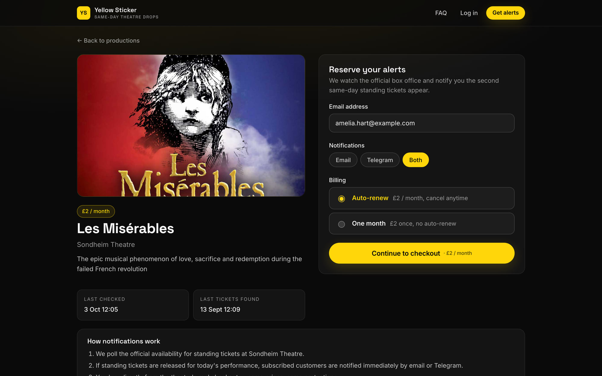
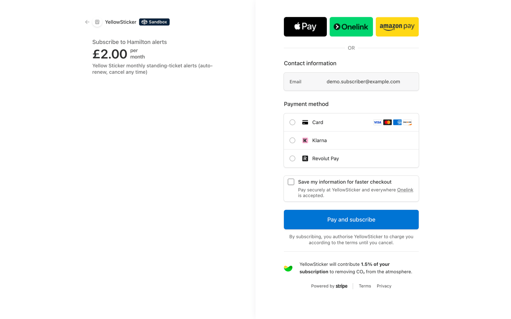
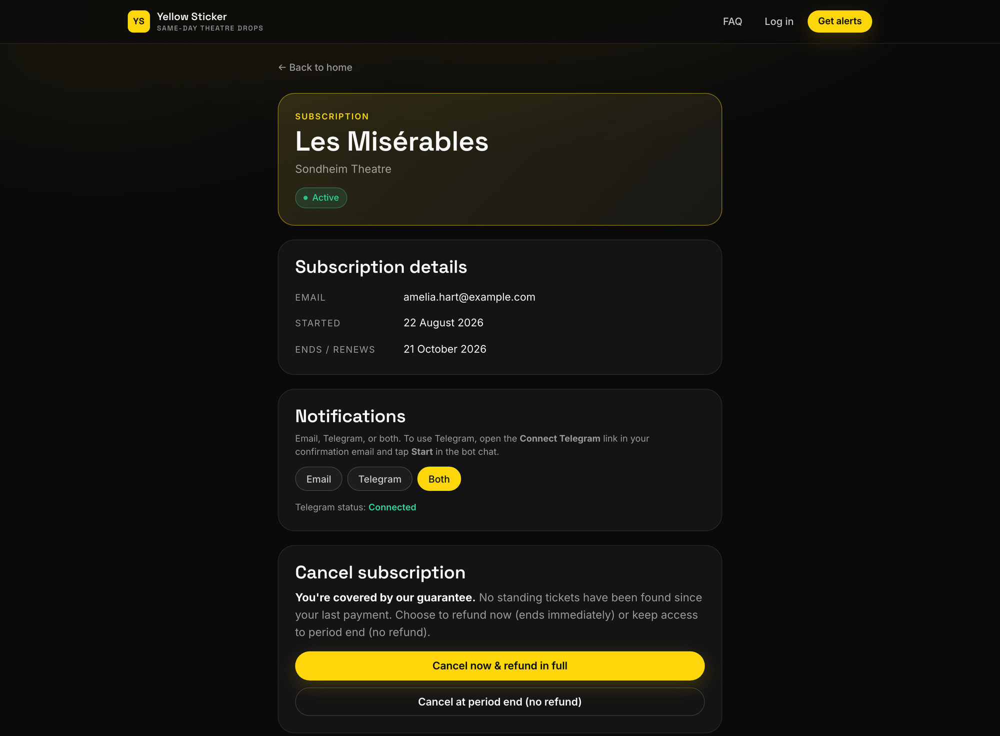
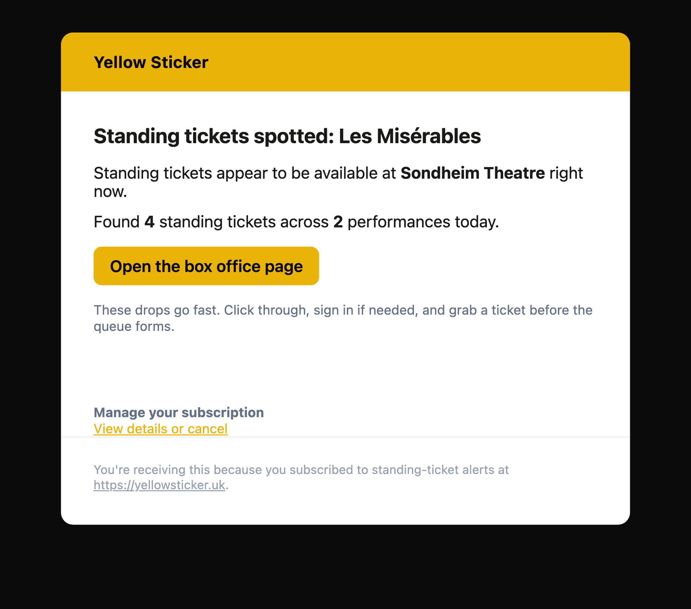
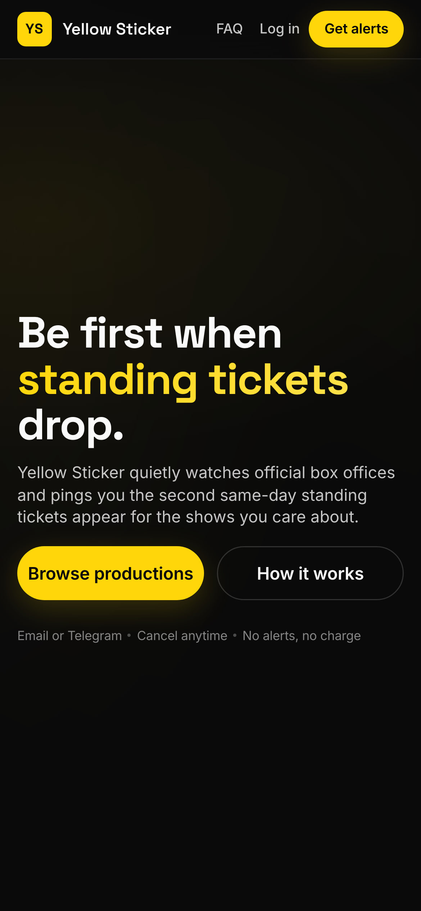
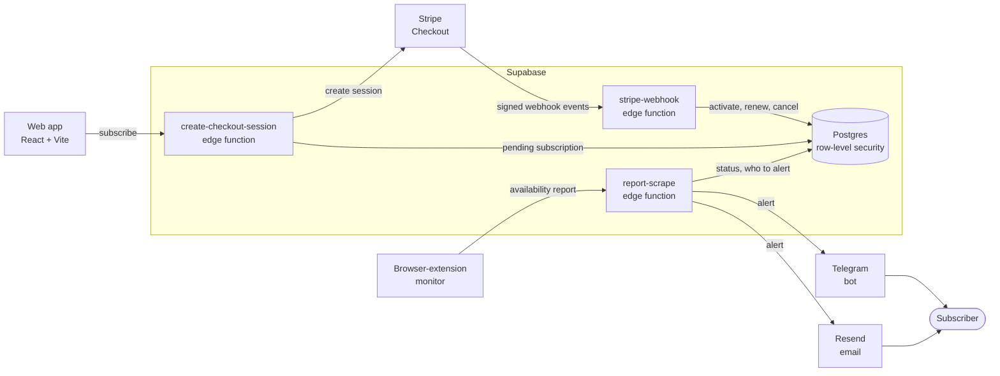

# Yellow Sticker

**[yellowsticker.uk](https://www.yellowsticker.uk)** · same-day standing-ticket alerts for **London West End** theatre. 

Subscribers are notified by **email** or **Telegram** when official box-office pages show standing availability — you always buy from the venue, at normal public prices.

> **Status:** Live in production · [yellowsticker.uk](https://www.yellowsticker.uk)  
> **Stack (at a glance):** hosted React site · Supabase (Postgres + Edge Functions) · Stripe subscriptions · Resend email · Telegram Bot API · Firefox extension scraper · Cloudflare Pages.


## Why it exists

Some West End theatres release cheap standing tickets on the day of a performance, and they sell out fast. The only way to catch them is to keep refreshing the box-office page, which is tedious and easy to miss. Yellow Sticker does the checking and tells you when tickets appear.

## What it does

- Pick a show and subscribe for £2 a month, or pay £2 once for a single month.
- Choose how to be alerted: email, Telegram, or both.
- Get one alert each time standing tickets appear, with a link straight to the theatre's own box office. You always buy from the venue.
- Manage or cancel from a link in any email. There is no account or password.
- Refund guarantee: if no standing tickets were found since your last payment, cancelling refunds it in full.

<table>
  <tr>
    <td width="50%"></td>
    <td width="50%"></td>
  </tr>
  <tr>
    <td width="50%"></td>
    <td width="50%"></td>
  </tr>
</table>

<p align="center">
  
</p>

Screenshots come from a local build with demo data and Stripe test mode. The same alert on Telegram is this message (sent with `parse_mode: HTML`):

```html
<b>Les Misérables</b>

Standing tickets look available at <b>Sondheim Theatre</b> right now.

Found <b>4</b> standing tickets across <b>2</b> performances today.

<a href="https://buytickets.delfontmackintosh.co.uk/tickets/series/SONLMSEPT25/">Open the box office page</a>

<a href="https://yellowsticker.uk/manage?token=…">Manage subscription</a>

<i>Yellow Sticker</i>
```

## Technical highlights

- **Subscription lifecycle driven by Stripe webhooks.** Checkout creates a pending row; the signed webhook activates it, records each renewal, schedules cancellation for a week after a show closes, and refunds any renewal that lands after the closing date. Redelivered events are recognised by id and skipped (`stripe-webhook`).
- **Refund guarantee enforced in code.** Cancelling compares the show's last ticket sighting with the start of the billing period and refunds the last payment through Stripe when nothing was found (`subscription-management`).
- **Row-level security on every table.** The browser can read the list of shows and nothing else; subscriber data is reachable only through edge functions using the service role (migrations).
- **Monitor-to-alert pipeline with per-event de-duplication.** Each availability report updates the show's state, and subscribers are alerted once per availability event rather than once per check (`report-scrape`).
- **Two notification channels.** Email through Resend and a Telegram bot linked to a subscriber by a one-time deep link, chosen per subscription (`_shared/`, `telegram-webhook`).

## Architecture



The web app reads the list of shows straight from Postgres and reaches everything else through edge functions. Cancellation and refunds go through a fourth function, `subscription-management`, which calls Stripe directly.

**Stack:** React 18, TypeScript and Vite · Supabase (Postgres, row-level security, Deno edge functions) · Stripe Checkout and webhooks · Resend · Telegram Bot API · a Firefox extension monitor · Cloudflare Pages.

Built with AI coding agents from my own specs and product design.

---

## For developers

The source repository is private. Paths below are relative to its root; the reference docs under `docs-internal/` are not published.

### Requirements

- Node 18+ and npm, for `web/`
- [Supabase CLI](https://supabase.com/docs/guides/cli), for migrations, secrets and deploying functions
- [Stripe CLI](https://docs.stripe.com/stripe-cli), signed in to a test-mode account
- Firefox, to run the monitor in `firefox-extension/`
- For the local stack below: PostgreSQL (`initdb`, `pg_ctl`, `psql`), [PostgREST](https://postgrest.org) and [Deno](https://deno.com). Docker is not needed.

### Local setup

Local development uses a small script that runs the backend without Docker: a throwaway Postgres with the repo's migrations and seed, PostgREST, the edge functions under Deno, and `stripe listen` forwarding test-mode webhooks.

```bash
stripe login
```

```bash
scripts/dev/local-stack.sh start
```

Install the web app's dependencies once:

```bash
cd web && npm install
```

The start script ends by printing the `npm run dev` command that points the web app at the local stack; it can be printed again with `scripts/dev/local-stack.sh env`. The variables in that command take priority over `web/.env.local`. Run it, then open <http://localhost:5173>. To finish:

```bash
scripts/dev/local-stack.sh stop
```

What the local stack does and does not do:

- It binds to `127.0.0.1` and keeps its state in `supabase/.temp/local/` (gitignored). It never contacts a hosted Supabase project.
- It refuses to start with a Stripe key that is not a test key. Pay with Stripe's [test cards](https://docs.stripe.com/testing), for example `4242 4242 4242 4242`.
- It sets no `RESEND_API_KEY` or `TELEGRAM_BOT_TOKEN`, so emails and Telegram messages are skipped and logged, never sent.
- It loads `scripts/dev/seed-demo.sql`: invented subscribers at `@example.com` in a range of states. For example, <http://localhost:5173/manage?token=demo-amelia-les-miserables> opens an active subscription.
- It applies every migration except three legacy ones that need the `pg_cron` extension; later migrations remove what those create, so the schema is the same.
- The admin login for `/monitor` is `admin` / `local-admin`, and the monitor's shared secret is `local-scraper-secret`.

The standard `supabase start` route is described in `docs-internal/DEVELOPMENT.md`.

Environment variables are documented in `docs-internal/env.sample` (edge functions) and `web/env.sample` (web app). Key naming and rotation are covered in `docs-internal/SECRETS.md`.

### Project structure

| Path | What it holds |
|------|---------------|
| `web/` | React single-page app: landing page, show pages, checkout success, manage page, FAQ, and the operator dashboard at `/monitor` |
| `supabase/functions/` | Deno edge functions. Subscriber-facing: `create-checkout-session`, `stripe-webhook`, `subscription-management`, `request-manage-link`, `telegram-webhook`. Monitor: `report-scrape`. Operator: `status-dashboard`, `admin-*`, `send-test-email` |
| `supabase/functions/_shared/` | Service-role database client, email templates, Telegram helpers |
| `supabase/migrations/` | SQL migrations, applied in timestamp order |
| `firefox-extension/` | The monitor: a WebExtension that reports box-office availability to `report-scrape`. See its README |
| `scripts/dev/` | Local stack and demo seed. Development only |
| [`docs/`]() | Reference documentation, listed below |

### Database and migrations

Seven tables in `public`: `users`, `productions`, `subscriptions`, `notification_logs`, `stripe_events`, `scrape_heartbeats` and `scraper_settings`. Row-level security is enabled on all of them. `productions` has a public read policy; the other six deny the API roles entirely, and only edge functions using the service role reach them. Column-by-column detail, the access model and queries for checking the live posture are in `docs-internal/DATABASE.md`.

Add new files under `supabase/migrations/` rather than editing applied ones, and apply them to the hosted project with:

```bash
supabase db push
```

### Deploying edge functions

```bash
supabase functions deploy
```

Secrets are set per project and never committed:

```bash
supabase secrets set STRIPE_SECRET_KEY=… STRIPE_WEBHOOK_SECRET=…
```

The full list is in `docs-internal/env.sample`. The Stripe webhook endpoint must subscribe to the seven events listed in `docs-internal/STRIPE_MODES.md`. Test and live mode are chosen purely by the key prefix; read `docs-internal/STRIPE_MODES.md` before switching between them.

The web app is a static build (`npm run build` in `web/`) with an SPA fallback in `web/public/_redirects`.

### Further documentation

| Doc | Contents |
|-----|----------|
| [`docs/ARCHITECTURE.md`](ARCHITECTURE.md) | Component-by-component data flow and failure modes |
| `docs-internal/DATABASE.md` | Tables, indexes, row-level security, migration reference |
| `docs-internal/DEVELOPMENT.md` | Local backend options, deploying functions, setting secrets |
| `docs-internal/STRIPE.md`, `docs-internal/STRIPE_MODES.md` | Test and live mode, going live, webhook setup |
| `docs-internal/SECRETS.md` | Key naming, rotation, Telegram secrets |
| `docs-internal/TESTING.md` | Manual end-to-end checks from the `/monitor` dashboard |

### Known limitations

- **No automated tests.** Checks are manual, through the `/monitor` dashboard's test fixture and the local stack.
- **One ticketing system.** The monitor has a single adapter, for Delfont Mackintosh theatres.
- **The monitor needs an always-on browser.** If it stops reporting, nothing is detected; `/monitor` shows the last heartbeat, but nothing notifies the operator.
- **Alert fan-out is synchronous**, sent in small batches and capped at 200 subscribers per report. Beyond that it would need a queue.
- **One Stripe mode per Supabase project at a time.** See `docs-internal/STRIPE_MODES.md`.
